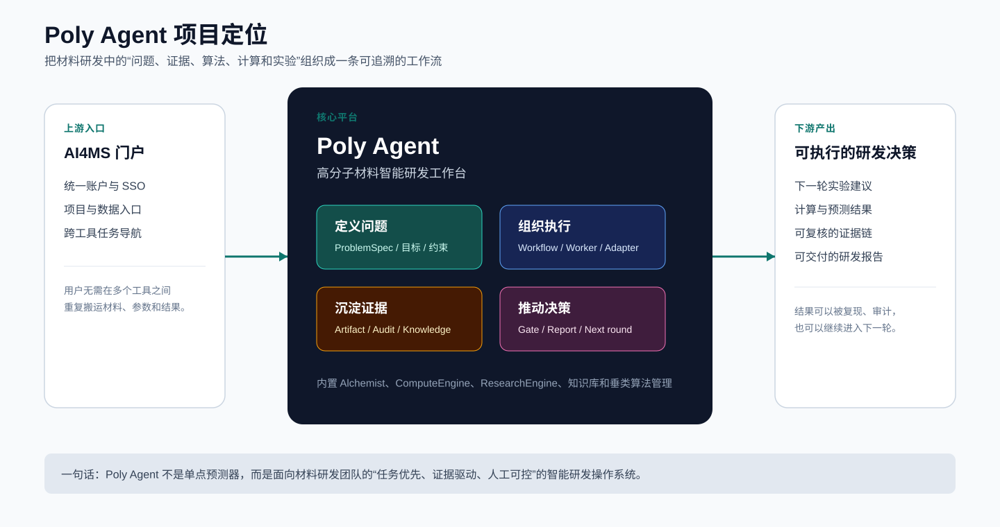
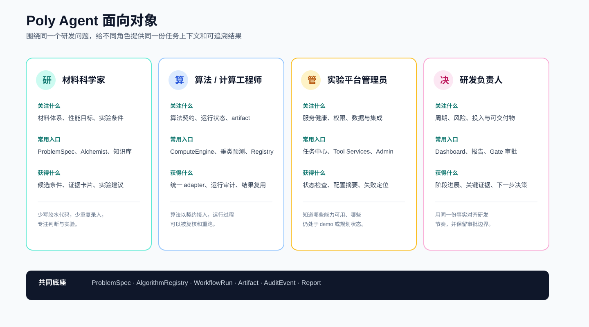
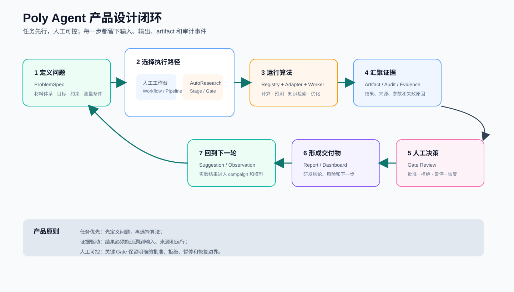
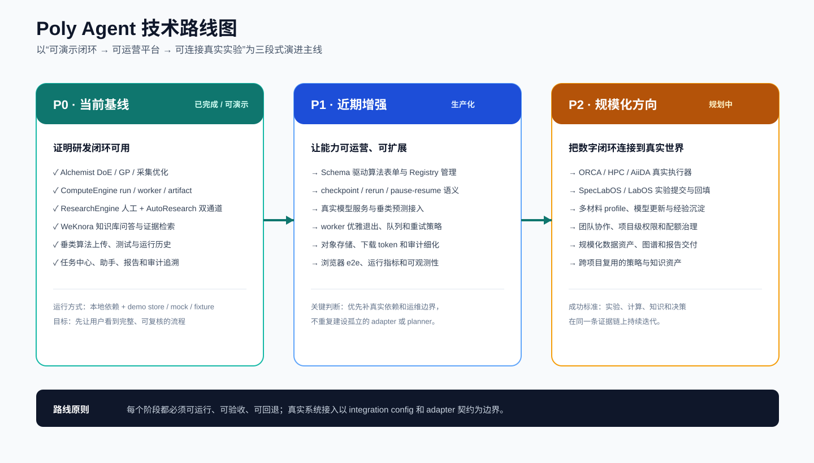
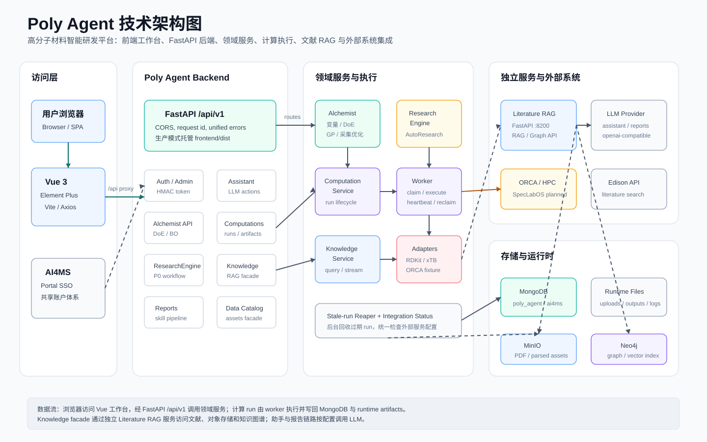

# Poly Agent

## 高分子材料智能研发工作台

Poly Agent 是 AI4MS 门户下的高分子材料智能研发平台，与 [Spec Agent](https://github.com/SynlysAI/Spec_Agent) 同属一个产品线。它把材料研发中的问题定义、实验设计、计算任务、垂类预测、文献证据和研发报告组织到同一条可追溯工作流中。

当前仓库的定位是 **“计算智能 + ResearchEngine P0 双通道闭环”演示与迭代基线**：本地结构生成、xTB、受控 ORCA/ComputeEngine fixture、Alchemist 优化、WeKnora 知识库、算法包管理和报告链路已经可以组合使用；真实 ORCA/HPC/AiiDA、SpecLabOS 设备提交和生产级外部模型服务仍通过集成配置逐步接入。

> 文档状态：2026-08-10。README 描述以当前代码和 `doc/` 进度文档为准；mock、fixture、demo store 和 fallback 只用于本地演示或验收，不代表生产模型或真实实验结果。

## 先看这几张图

### 项目定位



Poly Agent 位于 AI4MS 门户和具体算法/实验工具之间，承担任务上下文、编排、证据和决策闭环，而不是替代单个预测模型。

### 面向对象



平台面向材料科学家、算法与计算工程师、实验平台管理员和研发负责人；不同角色共享同一个 `ProblemSpec`、运行记录和证据链。

### 产品设计闭环



核心原则是“任务优先、证据驱动、人工可控”：先定义问题，再选择人工工作台或 AutoResearch，最后通过 Gate 和报告形成下一步行动。

### 技术路线图



路线分为三段：P0 证明闭环可用，P1 补齐生产化能力，P2 连接真实实验与规模化协同。详细的 ResearchEngine 和 ComputeEngine 计划见 [`doc/`](doc/)。

## 产品能力总览

| 领域 | 入口 | 解决的问题 | 当前边界 |
|---|---|---|---|
| **Alchemist** | `/optimization`、`/optimization/alchemist`、`/tools/alchemist` | 变量定义、DoE/OED、GP 建模、采集优化和诊断可视化 | 内置模块；真实实验执行仍需外部系统 |
| **ComputeEngine** | `/computations/submit`、`/computations/runs`、`/optimization/campaigns` | 统一提交计算、worker 执行、artifact 管理和 campaign 优化 | mock、RDKit/OpenBabel、本地 xTB 和 ORCA fixture 可用；真实 HPC/AiiDA 待接入 |
| **ResearchEngine** | `/research-engine` | ProblemSpec、人工 Workflow、Pipeline Run、AutoResearch Gate、追溯和报告 | P0 双通道可用；真实候选算法依赖外部服务配置 |
| **垂类预测** | `/vertical-prediction` | 算法包上传、治理、在线测试、运行历史、结果查看和 handoff | 运行时以算法契约和受限子进程为边界 |
| **Knowledge Base** | `/knowledge` | WeKnora 问答、证据清单和 Neo4j 增强检索子图 | 通过 WeKnora API 接入；Neo4j 图谱增强可选 |
| **Data Catalog** | `/database/data-catalog`、`/data-catalog` | 材料数据资产浏览、检索和只读外部数据接入 | 资产库使用 `poly_data` 与 MinIO |
| **助手与报告** | `/dialogue`、ResearchEngine 报告面板 | 基于项目事实导航、垂类算法工具调用、历史会话和结构化报告生成 | 算法工具仅来自已部署且 active 的垂类算法；支持 OpenAI、Ollama、Edison、Codex 和自定义 HTTP provider |
| **基础工作台** | `/dashboard`、`/tasks/center`、`/tools`、`/admin` | 统一任务视图、模型选择、集成状态和管理 | 与 AI4MS 门户共享认证体系 |

### 模块细节

- **Alchemist**：支持连续、整数、分类和离散变量；内置 LHS、Sobol、因子设计、CCD、Box-Behnken、Plackett-Burman 等 DoE/OED 方法；使用 scikit-learn/BoTorch GP 代理模型和 EI/PI/UCB/qEI/qUCB 采集策略，并提供 Parity、CV、Q-Q、校准和等值线诊断图。
- **ComputeEngine**：统一管理 queued/running/completed/failed/cancelled 生命周期；worker 原子领取任务、写 heartbeat 并回收 stale run；adapter 负责输入校验、执行、artifact 收集和结果解析；campaign 将 candidate、suggestion、computation 和 observation 串成优化闭环。
- **ResearchEngine**：以 `ProblemSpec` 约束研发问题，在同一问题下选择 `manual_workbench` 或 `autoresearch`；人工 Workflow 生成 `WorkflowRun/AlgorithmRun`，AutoResearch 生成 `ResearchRun/StageRun` 并在 Gate 等待审批；所有运行都保留输入快照、输出摘要、artifact 和 audit。
- **垂类预测**：支持 `.zip/.tar.gz` 算法包注册、版本管理、在线测试、运行历史、结果查看和 handoff；算法通过契约声明输入、输出、来源和运行时边界。
- **Knowledge Base**：KnowledgeService 统一转发 WeKnora 的知识库列表、问答流和无总结检索；前端展示证据卡片，后端可用 Neo4j 补充 Entity 关系，并过滤 API key、object key 和 embedding 等敏感元数据。
- **Data Catalog**：面向材料数据资产提供目录、分类和筛选；业务运行态写入 `poly_agent`，材料资产使用 `poly_data` MongoDB 和 MinIO `datasets/` 路径。
- **助手与报告**：助手基于项目实时事实返回入口、算法、计算和审批引导；`/dialogue` 支持按用户隔离的历史会话、已部署垂类算法工具选择、参数确认、AlgorithmRun 结果与 artifact 回链；报告链路支持 OpenAI/Ollama/Edison/Codex/自定义 HTTP provider，以及 HTML/LaTeX/Markdown/PDF renderer。

## 当前项目状态

| 模块 | 状态 | 说明 |
|---|---|---|
| Alchemist 实验设计与优化 | ✅ MVP 完成 | 变量、DoE/OED、GP、采集优化和诊断可视化可用 |
| ComputeEngine 计算智能 | ✅ MVP 基本完成 | run 生命周期、worker、artifact、campaign 和集成状态可用 |
| ResearchEngine | ✅ P0 完成 | 人工 Workflow 与 AutoResearch 双通道、Gate、追溯、示例和报告可用 |
| 垂类预测 | ✅ 基础可用 | 算法包上传、测试、运行历史和结果查看已集成 |
| Knowledge Base | ✅ WeKnora 已接入 | 知识库、问答流、证据和检索子图可用 |
| Data Catalog | ✅ 基础可用 | 目录浏览、筛选和资产读取可用 |
| 认证、助手、任务中心 | ✅ 基础可用 | HMAC token、门户 SSO、对话历史、垂类算法工具调用和跨模块任务视图可用；真实模型/算法服务依赖环境配置 |
| 真实 ORCA/HPC/AiiDA/SpecLabOS | 📋 规划中 | 通过 integration config 和 adapter 契约逐步接入 |

### 下一阶段优先级

1. **P1 生产化**：Schema 驱动算法表单、AlgorithmRegistry 管理、真实预测模型服务、checkpoint/rerun、worker 运维、对象存储，以及更多页面的浏览器 e2e。
2. **P2 真实执行**：ORCA/HPC/AiiDA executor、SpecLabOS/LabOS 实验提交与结果回填。
3. **P2 规模化协同**：材料 profile、模型更新与经验沉淀、项目级权限/配额、跨项目知识与策略复用。

## 技术路线与架构

### 分层架构



数据流为：浏览器访问 Vue 工作台，经 FastAPI `/api/v1` 调用领域服务；计算 run 由 worker 原子领取并执行，通过 adapter 产出 artifact，结果、审计和关联关系写入 MongoDB/runtime；KnowledgeService 通过 WeKnora API 获取知识库、证据和检索子图；助手与报告按配置调用 LLM provider。

### 关键领域对象

```text
ProblemSpec
  ├── ExecutionDecision: manual_workbench | autoresearch
  ├── ManualAlgorithmWorkflow -> WorkflowRun -> AlgorithmRun
  └── ResearchRun -> StageRun -> GateReview

AlgorithmRun / ComputationRun
  ├── input snapshot
  ├── output summary
  ├── artifact[]
  └── audit event[]

Campaign -> Candidate -> Suggestion -> ComputationRun -> Observation -> next suggestion
```

### 技术栈

| 层 | 技术 |
|---|---|
| 前端 | Vue 3、Element Plus、Vite、Axios、ECharts、Plotly |
| 后端 | Python 3.12、FastAPI、Pydantic、MongoDB |
| 计算 | RDKit、OpenBabel、xTB、CREST、ORCA fixture、BoTorch、scikit-learn |
| 知识与报告 | Tencent WeKnora、可选 Neo4j、多 LLM provider、多格式 renderer |
| 运行与部署 | Conda、PM2、runtime 文件目录、MinIO 数据资产 |
| 认证 | HMAC-SHA256 token，与 AI4MS 门户共享账户/邀请码 |

### 项目结构（入口级）

```text
Poly_Agent/
├── backend/app/
│   ├── api/v1/endpoints/       # FastAPI 路由
│   ├── services/               # 领域服务与报告/知识库编排
│   ├── schemas/                # Pydantic 契约
│   ├── computation_adapters/   # mock / local / ORCA fixture adapter
│   ├── alchemist_core/        # DoE、GP、采集优化和诊断
│   ├── workers/                # computation worker 与 stale-run reaper
│   └── infra/                  # MongoDB、SQLite、repository
├── frontend/src/
│   ├── views/                  # 工作台页面
│   ├── api/                    # Axios API client
│   ├── router/、auth/          # 路由、门户 SSO 和登录
│   └── style.css               # 全局设计系统
├── doc/                        # 用户指南、产品设计、计划与验收
├── docs/                       # README 使用的架构/定位/路线图 SVG
├── examples/                   # 算法包与接口示例
├── scripts/                    # 环境、服务、迁移和算法打包工具
├── deploy/toolchain/           # 部署清单和环境模板
├── DESIGN.md                  # 前端设计规范
└── Makefile / ecosystem.config.js / environment.yml
```

## 快速开始

### 环境准备

要求：Conda、Python 3.12、Node.js 22；开发/测试使用本地 SQLite，生产需要 MongoDB。

```bash
# 创建或更新项目环境，并安装前端依赖
bash scripts/setup_poly_agent_env.sh
conda activate poly_agent
```

### 配置

```bash
cp backend/.env.example backend/.env
# 至少检查 APP_ENV、AUTH_ENABLED、AUTH_SECRET 和 MongoDB 配置
```

知识库功能需要可访问的 WeKnora：

```bash
WEKNORA_BASE_URL=http://<weknora-host>:8000/api/v1
WEKNORA_API_KEY=<weknora-api-key>
WEKNORA_DEFAULT_KB_ID=<knowledge-base-id>
# 可选图谱增强
WEKNORA_NEO4J_URI=bolt://<neo4j-host>:7687
WEKNORA_NEO4J_USERNAME=neo4j
WEKNORA_NEO4J_PASSWORD=<neo4j-password>
WEKNORA_NEO4J_DATABASE=neo4j
```

### 开发模式

```bash
bash scripts/restart_poly_agent_services.sh
```

默认地址：

- 前端：`http://127.0.0.1:5200`
- 后端：`http://127.0.0.1:5201`

重启脚本会启动后端、前端和 computation worker；日志默认写入 `/tmp/poly_agent_backend.log`、`/tmp/poly_agent_frontend.log`、`/tmp/poly_agent_worker.log`。停止服务：

```bash
bash scripts/stop_poly_agent_services.sh
```

开发/测试环境默认使用本地 SQLite，不再连接远端 MongoDB。poly data 只导入每个数据集最多 100 条样本，验证数据目录功能即可：

```bash
# 推荐把源 Mongo 只读连接串注入环境变量，避免写入 shell 历史
export SEED_POLY_DATA_MONGODB_URI='mongodb://<user>:<password>@<host>:27018'
python scripts/seed_poly_data_sqlite.py --source-database poly_data --sample-size 100
```

该脚本对源库只读，目标文件默认为 `.runtime/poly-agent.sqlite3`；如需预览样本清单可加 `--dry-run`。默认按集合合并、不清空现有数据；显式加 `--reset` 时只重灌 `poly_data.*` 集合，账号与其它业务数据不会丢失。

### 生产部署

```bash
cp deploy/toolchain/env/backend.env.template backend/.env
npm --prefix frontend run build
pm2 start ecosystem.config.js
pm2 save
```

生产模式下后端会托管 `frontend/dist`，默认访问 `http://<host>:5201`。

## 常用命令与验证

| 命令 | 作用 |
|---|---|
| `make test-backend` | 运行 `backend/tests` pytest |
| `make test-frontend-build` | 构建 Vue 前端 |
| `make test-e2e` | Playwright 验证对话 LUI 真实模型流程与 320/768/1440px 响应式布局（需前后端和 PI Mock 服务已启动） |
| `make check-all` | 后端测试、前端构建和对话 LUI e2e 验收 |
| `npm --prefix frontend run test:llm-models` | LLM 模型配置单测 |
| `npm --prefix frontend run test:vertical-prediction` | 垂类预测与 artifact 下载单测 |
| `npm --prefix frontend run test:assistant-tool-calls` | 对话算法工具 SSE/reducer 单测 |
| `npm --prefix frontend run test:tool-menu-categories` | 对话工具菜单分类与筛选单测 |
| `make init-mongo-indexes` | 初始化生产查询索引 |
| `python scripts/pack_algorithm.py --help` | 查看算法包打包参数 |
| `python scripts/update_algorithm_visibility.py --dry-run` | 预览算法 visibility 修正 |
| `bash scripts/run_compute_engine.sh status` | 查看 ComputeEngine 参考服务状态 |

E2E 默认使用后端 `5201`、前端 `5200` 和 PI Mock `8300`；临时环境可通过 `POLY_AGENT_BACKEND_URL`、`POLY_AGENT_FRONTEND_URL`、`POLY_AGENT_PI_MOCK_URL` 覆盖。

当前 Playwright 覆盖 `/dialogue` 的算法工具完整交互和 320/768/1440px 响应式验收（见 [`e2e/README.md`](e2e/README.md)）；其他页面仍以后端回归、前端构建和关键页面手工验收为主。ResearchEngine 的历史测试记录与已知限制见 [`doc/research-engine-progress-and-plan.md`](doc/research-engine-progress-and-plan.md)。

## 配置边界与安全

后端从 [`backend/.env`](backend/.env) 读取配置，模板见 [`backend/.env.example`](backend/.env.example)。常用配置如下：

| 配置组 | 关键变量 | 说明 |
|---|---|---|
| 运行与安全 | `APP_ENV`、`CORS_ALLOWED_ORIGINS`、`CORS_ALLOW_CREDENTIALS` | 非本地环境校验 CORS、认证和密钥安全 |
| 认证 | `AUTH_ENABLED`、`AUTH_SECRET`、`AUTH_MONGODB_URI` | 支持本地账号和 AI4MS 共享认证库 |
| 存储后端 | `STORAGE_BACKEND`、`SQLITE_DATABASE_PATH` | 本地/测试默认 `sqlite`；生产非本地环境默认 `mongodb`，且禁止配置成 `sqlite` |
| 主数据 | `MONGODB_HOST`、`MONGODB_PORT`、`MONGODB_DATABASE`、`REQUIRE_MONGODB` | 仅 `STORAGE_BACKEND=mongodb` 时启用；SQLite 模式不会连接 MongoDB |
| 运行时目录 | `POLY_AGENT_RUNTIME_ROOT`、`POLY_AGENT_UPLOAD_ROOT`、`POLY_AGENT_OUTPUT_ROOT`、`POLY_AGENT_LOG_ROOT` | 上传、产物、报告和日志目录 |
| 计算工具链 | `XTB_EXECUTABLE`、`CREST_EXECUTABLE`、`ORCA_EXECUTABLE`、`ORCA_EXECUTION_MODE` | 真实 xTB/CREST/ORCA 执行依赖本地命令和许可证 |
| 算法运行时 | `ALGORITHM_RUNTIME_BACKEND`、`ALGORITHM_RUNTIME_MAX_CONCURRENCY`、`ALGORITHM_RUNTIME_MAX_OUTPUT_BYTES` | 上传算法使用受限子进程运行 |
| LLM 与报告 | `LLM_*`、`REPORT_*` | 助手、Alchemist LLM 辅助和报告生成 |
| 知识库 | `WEKNORA_*` | WeKnora API 和可选 Neo4j 图谱增强 |
| 数据资产 | `DATA_ASSET_MONGODB_*`、`MINIO_*` | 生产读取 `poly_data` 数据库和 MinIO；开发使用本地 SQLite poly data 样本 |

安全边界：集成配置只保存 endpoint、config summary 和 secret refs；API 不返回 API key、object key、storage URI、embedding 或本地敏感路径。生产环境必须设置足够长度的 `AUTH_SECRET`，并关闭不必要的 demo/fallback 路径。

## 文档导航

完整文档地图见 [`doc/README.md`](doc/README.md)。按目标查阅：

| 目标 | 文档 |
|---|---|
| 本地启动与部署 | [`doc/poly-agent-toolchain-deployment-pack.md`](doc/poly-agent-toolchain-deployment-pack.md) |
| 计算工作流 | [`doc/computation-workflows-user-guide.md`](doc/computation-workflows-user-guide.md)、[`doc/compute-engine-computation-progress-and-plan.md`](doc/compute-engine-computation-progress-and-plan.md) |
| 实验设计与优化 | [`doc/optimization-workflow-user-guide.md`](doc/optimization-workflow-user-guide.md) |
| ResearchEngine / AutoResearch | [`doc/autoresearch-user-guide.md`](doc/autoresearch-user-guide.md)、[`doc/research-engine-and-auto-research-design.md`](doc/research-engine-and-auto-research-design.md) |
| ResearchEngine 路线与验收 | [`doc/research-engine-plan-00-roadmap.md`](doc/research-engine-plan-00-roadmap.md)、[`doc/research-engine-progress-and-plan.md`](doc/research-engine-progress-and-plan.md) |
| 算法包上传与远程模型 | [`doc/algorithm-upload-user-guide.md`](doc/algorithm-upload-user-guide.md)、[`doc/vertical-model-interface-user-guide.md`](doc/vertical-model-interface-user-guide.md) |
| 知识库 RAG + 图谱 | [`doc/knowledge-base-rag-kg-product-design.md`](doc/knowledge-base-rag-kg-product-design.md) |
| 报告生成 | [`doc/research-report-generation-product-design.md`](doc/research-report-generation-product-design.md) |
| 来源与引用标注 | [`doc/polyagent-attribution-source-matrix.md`](doc/polyagent-attribution-source-matrix.md) |
| 前端设计规范 | [`DESIGN.md`](DESIGN.md) |

更新根 README 时，请同步检查 [`doc/README.md`](doc/README.md) 的文档地图；涉及外部框架、机构、模型或算法包时，同步更新来源矩阵。

## 框架、方法与机构来源

Poly Agent 在产品页面维护统一的来源与引用标注。外部框架和机构是参考来源，不等于本项目的代码归属或生产能力：

| 模块 | 参考来源 | 本项目实现边界 |
|---|---|---|
| ResearchEngine / 计算编排 | ChemOS 2.0、University of Toronto / Aspuru-Guzik Group | 本项目实现 ProblemSpec、Workflow、AlgorithmRun、Gate、追溯和报告 |
| Alchemist | NatLabRockies / NREL / NLR ALchemist | 本项目负责中文工作台、认证、会话和平台集成 |
| ComputeEngine | RDKit、OpenBabel、xTB、CREST、ORCA | 本项目负责 run、worker、artifact、审计和 campaign 联动 |
| Knowledge Base | Tencent WeKnora、可选 Neo4j | 本项目提供 KnowledgeService facade、证据映射和安全元数据 |
| 垂类预测 | 算法包开发者与机构 | 方法、模型和开发者来源来自算法契约；平台负责治理、运行和交付 |

完整矩阵：[`doc/polyagent-attribution-source-matrix.md`](doc/polyagent-attribution-source-matrix.md)。

## 相关项目

- [AI4MS](https://github.com/SynlysAI/AI4MS)：高分子智能研发门户与统一账户入口
- [Spec Agent](https://github.com/SynlysAI/Spec_Agent)：谱图智能分析平台

## 许可证与使用边界

仓库当前主要面向 AI4MS 产品线内部研发、演示和集成验证。使用外部框架、模型、数据集或算法包时，请遵守其原始许可证、引用和服务条款；不要把 mock、fixture 或本地 SQLite 样本的结果当作真实实验结论。
